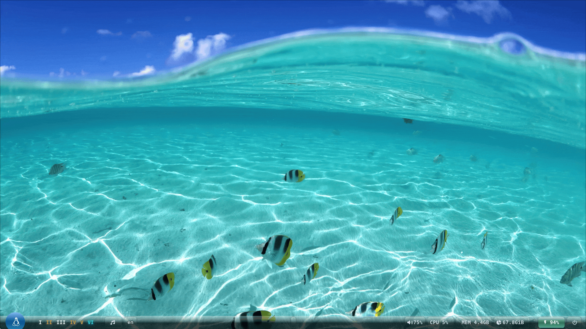
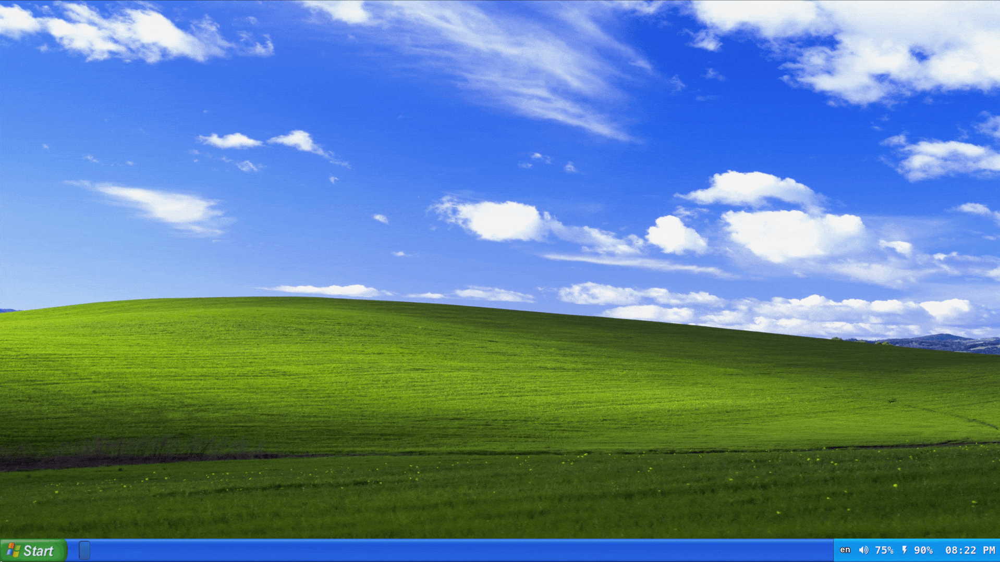
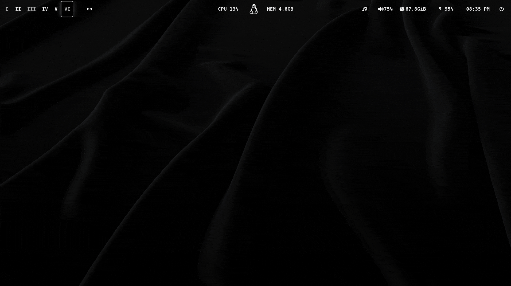
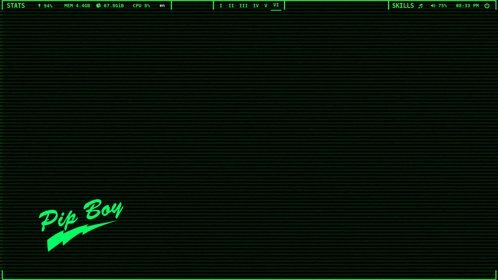

# MHD RiceInstaller

Welcome to the MHD RiceInstaller! This project provides a collection of beautiful rice configurations for your Linux desktop environment. Below, you can see previews of the available themes.
- Here is a demo:


## Features

- **Complete Wayland Setup**: Pre-configured Hyprland, Hyprlock, Hypridle, Kitty terminal, Mako notifications, Waybar, and more
- **Productivity Scripts**: Custom scripts for audio switching, cheatsheets, keyboard layouts, power menu, wallpaper management, and rice selection
- **Neovim IDE**: Fully configured Neovim with plugins for coding, LSP support, and productivity
- **Zsh Shell**: Enhanced Zsh with syntax highlighting, autosuggestions, and history substring search
- **Automated Installer**: One-command installation script for easy setup
- **Rice Creator**: You can create your own custom rice using the rice creator command. Here is a demonstration:


---

| Bubble | Rainbow |
|--------|---------|
|  |  |

| Frutiger | WinXP |
|----------|-------|
|  |  |

| Cream | Mono |
|-------|------|
|  |  |

| Pipboy | Solarized |
|--------|-----------|
|  |  |

| Yellowpunk | Redpunk |
|------------|---------|
|  |  |

| y2k |
|-----|
|  |

## Installation

To install using the automated script, run the following command:

```sh
chmod +x RiceInstaller.sh && ./RiceInstaller.sh
```

## Manual Installation

If you prefer to install manually without the script, follow these steps:

1. Copy the "ConfigFiles" directory to your `.config` directory.
2. Copy the ".zshrc" file to your home directory (`/home/$(whoami)`).
3. Install the required packages for your system to function as a daily driver using the appropriate command below:

   - **Gentoo**:
     ```sh
     sudo emerge --sync && sudo emerge $(cat Gentoo-Rice-packages.md)
     ```
     **Note**: Do not install blindly. Please check the use flags and GPU requirements before proceeding.

   - **Arch**:
     ```sh
     paru -Syu --no-confirm && paru -S --no-confirm $(cat arch-rice-wayland-packs.txt)
     ```
     **Note**: Remember to install the appropriate GPU packages as well.

   **Additional Note**: There are specialized packages available for specific operating system types. You may choose to install them after running the RiceInstaller script if desired.

## Acknowledgments

Special thanks to:
- [OliveThePuffin](https://github.com/OliveThePuffin/yorha-grub-theme) for the GRUB theme.
- [stepanzubkov](https://github.com/stepanzubkov/where-is-my-sddm-theme) for the SDDM theme.
